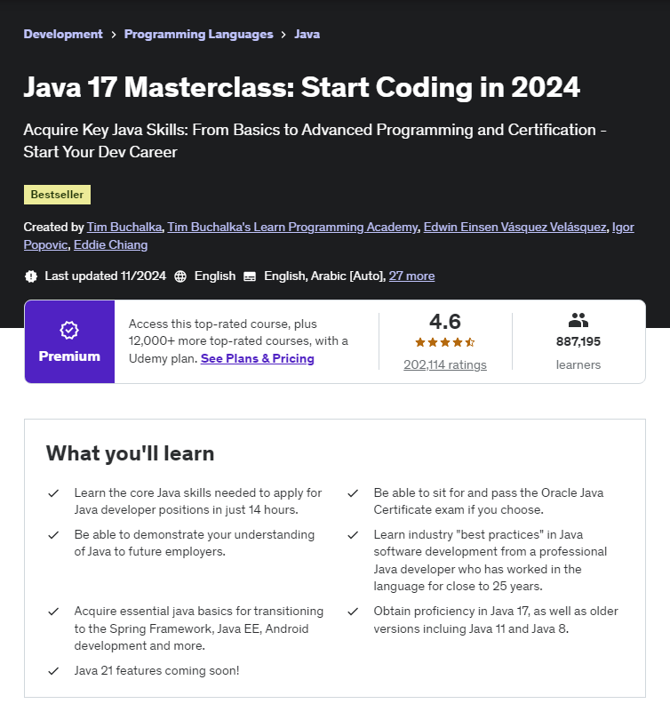

# Java17MasterClassCourse

Currently completing this Java Udemy Course to further develop my understanding of Java

Here is a link to the course: https://www.udemy.com/course/java-the-complete-java-developer-course

# Project Key Legend
In src/main/java/com/udemy, the **P in P## stands for "Project"** and **the numbers following stand for the video number.**

***ex: P39 means Project for 39th Video***

# Screenshot

